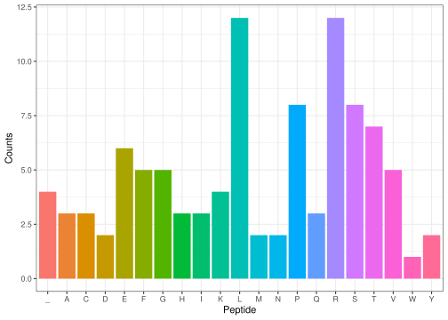

<!-- README.md is generated from README.Rmd. Please edit that file -->

# gene2protein

<!-- badges: start -->
<!-- badges: end -->

``` r
library(gene2protein)
```

# Repository

<https://github.com/rforbiodatascience23/group21package>

# Functions

### Function 1 - random_peptide()

Function 1 takes an integer input, that specifies the desired length of
a DNA sequence. It then generates a random sequence, of the specified
length, using the nucleotide bases **adenine (A), cytosine (C), guanine
(G) and thymine (T)**. The “collapse” function is implemented to string
these nucleotides together.

``` r
dna <- random_peptide(300)
dna
#> [1] "ATGTCTGAGTTTAGGAAACGTTCTATATATGAGCTATCGCCACGTGAGCCTCCCCAATGCGGCCGGATTTTACGTCACATTCGGCTACTAATGGACTAGCTTTTCCGCCCATATTGCACATGCGGTTTGGAGCGTTCGCATCTTGTAGCAACTCAAACCAAAAGTTAGCGCTCTGGCTGGTTTGTTGCAGAGCTAAAGTTTTTGACTACTCAAGTACCATTAGGCCGTCGTAATGGGAATTCCCCTACCGTCCCAGAGACAGACGCCTCTCGGGTGCTTCCACACTTCAAGTTATAATAA"
```

### Function 2 - convert_t\_to_u()

The function `convert_t_to_u` takes a DNA sequence as input and returns
the corresponding RNA sequence where thymine (T) has been replaced with
uracil (U). The function achieves this by using the `gsub` function to
replace all occurrences of “T” with “U” in the DNA sequence. This
function can be used to convert a DNA sequence into an RNA sequence by
substituting thymine with uracil. It is important to note that the
function assumes the input DNA sequence is valid and does not perform
any error checking.

``` r
rna <- convert_t_to_u(dna)
rna
#> [1] "AUGUCUGAGUUUAGGAAACGUUCUAUAUAUGAGCUAUCGCCACGUGAGCCUCCCCAAUGCGGCCGGAUUUUACGUCACAUUCGGCUACUAAUGGACUAGCUUUUCCGCCCAUAUUGCACAUGCGGUUUGGAGCGUUCGCAUCUUGUAGCAACUCAAACCAAAAGUUAGCGCUCUGGCUGGUUUGUUGCAGAGCUAAAGUUUUUGACUACUCAAGUACCAUUAGGCCGUCGUAAUGGGAAUUCCCCUACCGUCCCAGAGACAGACGCCUCUCGGGUGCUUCCACACUUCAAGUUAUAAUAA"
```

### Function 3 - codons()

The intended application for the function is to split a given RNA
sequence into codons from the specified start position in line with
translation of RNA. The function then returns a vector of codons.

Function Operation: The input for the function is a string and a integer
for overall start position. Based on the length of the string and the
start position, the function will create a vector of substrings with the
function substring(). The substring() function operates by creating two
vectors; one for the start position and one for the stop position for
each codon and splitting the string based on each set of start/stop
position. NOTE: The function has no input-control and as consequence any
non-RNA string can be given and the function will still split it.

The following example displays calling the function with the variable
created by function 2 and the output of the function

``` r
split_codons <- codons(rna)
split_codons
#>   [1] "AUG" "UCU" "GAG" "UUU" "AGG" "AAA" "CGU" "UCU" "AUA" "UAU" "GAG" "CUA"
#>  [13] "UCG" "CCA" "CGU" "GAG" "CCU" "CCC" "CAA" "UGC" "GGC" "CGG" "AUU" "UUA"
#>  [25] "CGU" "CAC" "AUU" "CGG" "CUA" "CUA" "AUG" "GAC" "UAG" "CUU" "UUC" "CGC"
#>  [37] "CCA" "UAU" "UGC" "ACA" "UGC" "GGU" "UUG" "GAG" "CGU" "UCG" "CAU" "CUU"
#>  [49] "GUA" "GCA" "ACU" "CAA" "ACC" "AAA" "AGU" "UAG" "CGC" "UCU" "GGC" "UGG"
#>  [61] "UUU" "GUU" "GCA" "GAG" "CUA" "AAG" "UUU" "UUG" "ACU" "ACU" "CAA" "GUA"
#>  [73] "CCA" "UUA" "GGC" "CGU" "CGU" "AAU" "GGG" "AAU" "UCC" "CCU" "ACC" "GUC"
#>  [85] "CCA" "GAG" "ACA" "GAC" "GCC" "UCU" "CGG" "GUG" "CUU" "CCA" "CAC" "UUC"
#>  [97] "AAG" "UUA" "UAA" "UAA"
```

### Function 4 - codon_to_aa()

Takes a codon and converts it to an amino acid shortcode.

Function Operation: The function takes a single string codon or a vector
of string codons as an argument and converts the codons via. the codon
table. The value/values of the convertion are then concatenated into a
single string amino acid sequence, which is the return of this funciton.

Function Handling: Input specifically needs to be RNA codons of amino
acids, since the function looks up the codon in the codon table stored
in this package “gene2protein”.

``` r
aa_seq <- codon_to_aa(split_codons)
aa_seq
#> [1] "MSEFRKRSIYELSPREPPQCGRILRHIRLLMD_LFRPYCTCGLERSHLVATQTKS_RSGWFVAELKFLTTQVPLGRRNGNSPTVPETDASRVLPHFKL__"
```

### Function 5 - aa_content()

This function finds unique amino acids in the peptide and creates a
barplot for the number of occurrences for each amino acid.

The function splits the input string with the stringr package’s
“boundary” function and counts the occurances of each unique amino acid
with the “str_count” function. It does not have a pre-concieved notion
of the amino acid symbols, but they have to be single-letter codes.

The output plot is created via the ggplot2 package and uses the
functions “ggplot”, “aes”, “geom_col”, “theme_bw”, and “theme”.

``` r
aa_content(aa_seq)
```



# Discussion

### Use cases

Our package covers every step in the central dogma from the creation of
sample DNA to the translation of peptide sequences.

### Additional functions

Rather than inputting a sample sequence, the function could take as
input, a fasta file of DNA sequence data, and output a fasta file
containing the translated peptide data.
